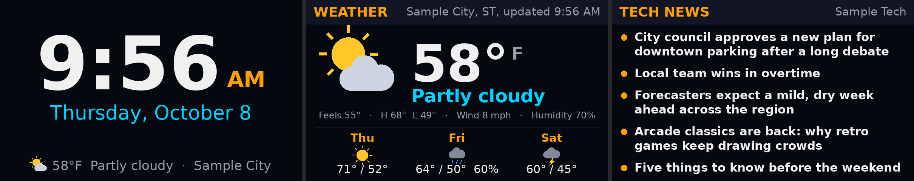
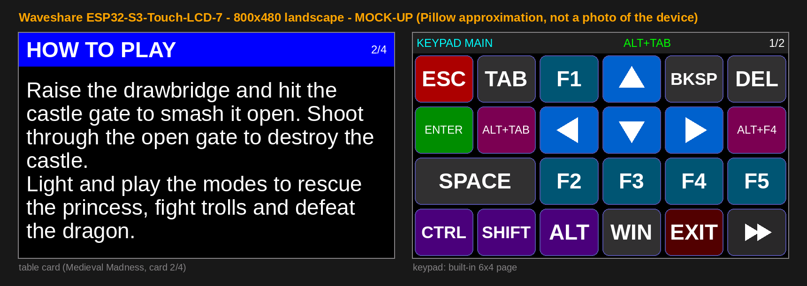
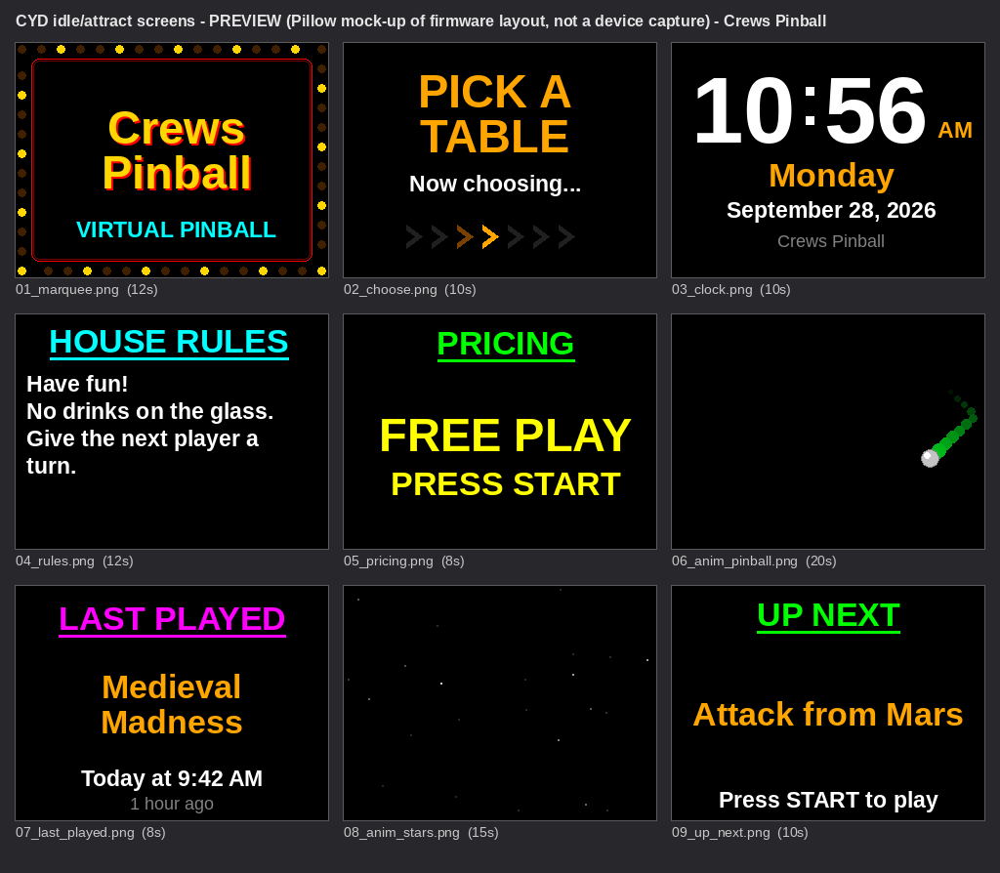
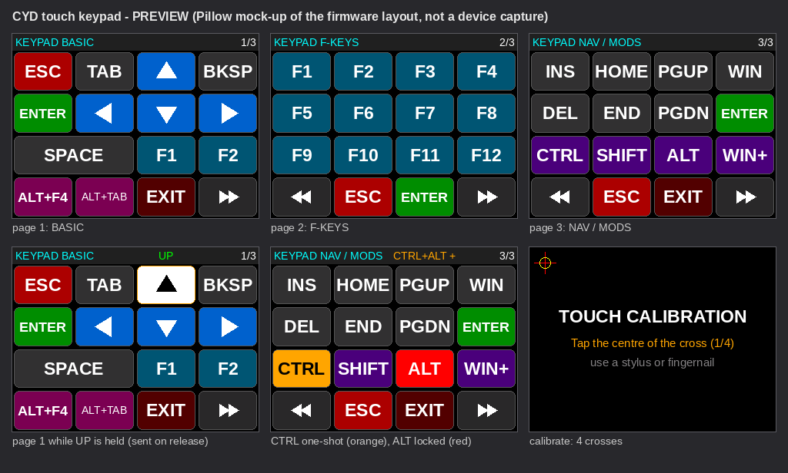
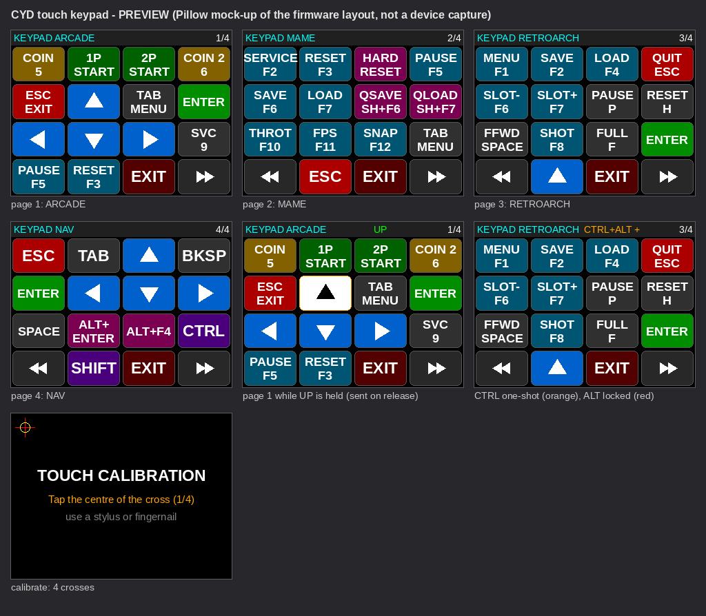
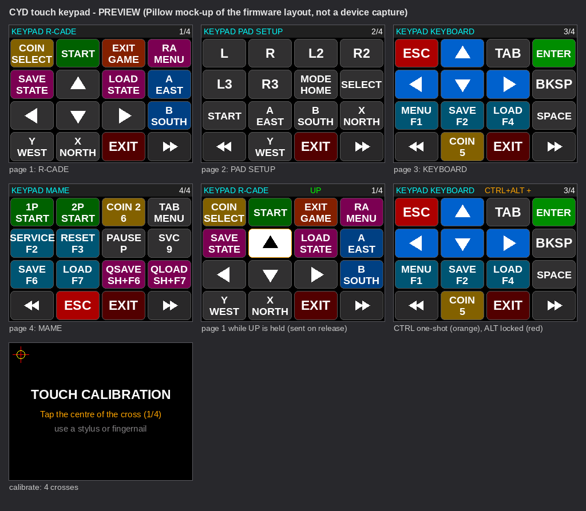
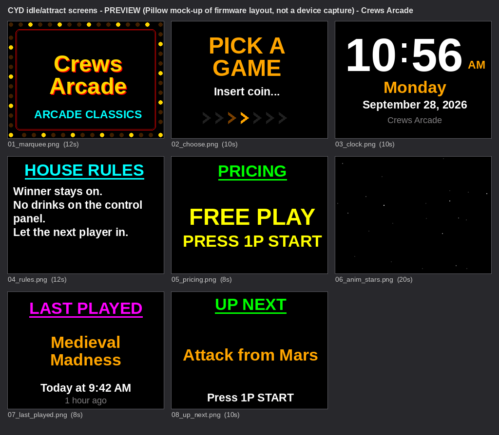
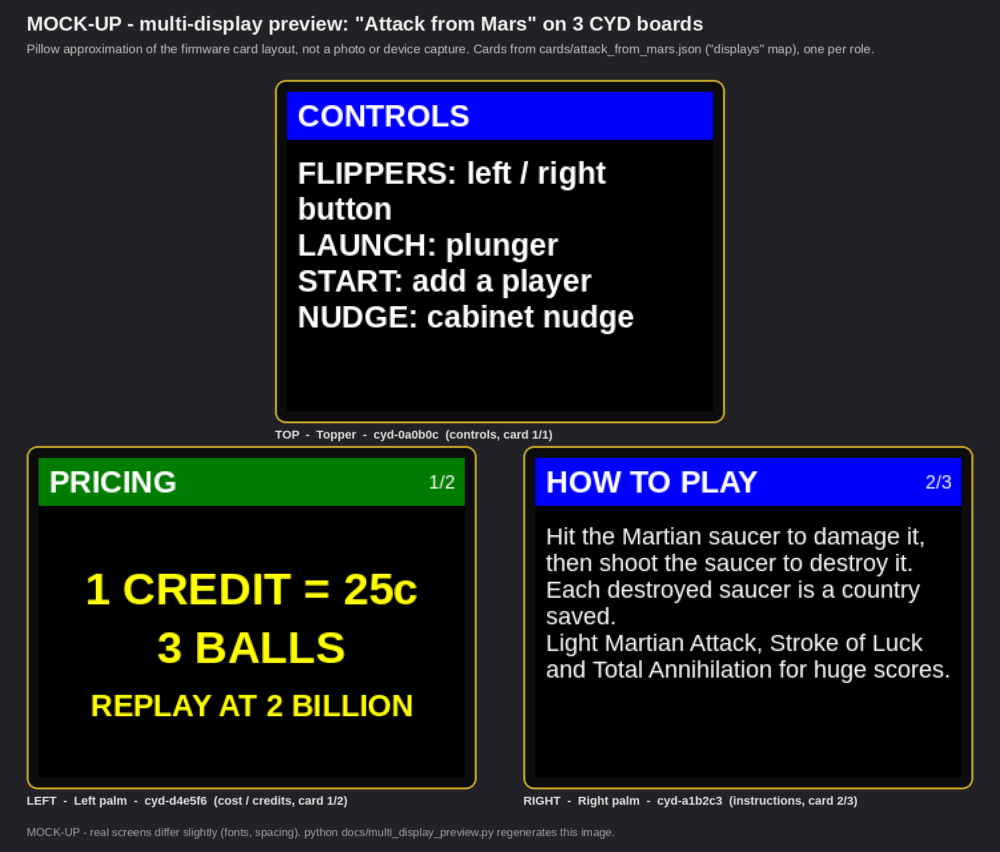
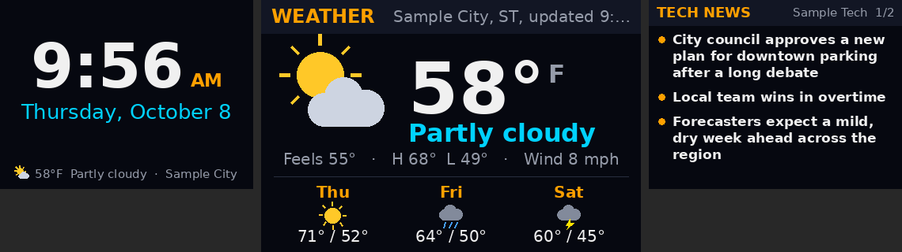

# CYD Cabinet Cards: house-wide ESP32 displays for pinball and arcade cabinets

*(repository name: `cyd-pinball-cards`)*

Cheap ESP32 touch screens next to your cabinet, or anywhere in the house, that show what the
frontend is doing: the game's box art, gameplay screenshots, control-panel layout, how to play,
rules and pricing while a game is picked or running, an attract playlist while nothing runs,
and a clock with weather and tech news at night. They can also turn into a touch keypad for the keys a cabinet
lacks. Firmware (PlatformIO) plus host tools (Python 3, Windows and Linux) that plug into
**LaunchBox / Big Box, PinUP Popper, R-Cade, Batocera, RetroBat, RetroPie and ES-DE**.



*Info slides as the host renders them for the 7" (800×480): clock, weather, tech headlines.
Output of `python host/cyd_night.py preview --offline` with sample data, the same images that are
sent to the boards.*

## Highlights

* **Three boards, one firmware:** the 2.8" "Cheap Yellow Display" (ESP32-2432S028R),
  the 3.5" ESP32-3248S035R and the 7" Waveshare ESP32-S3-Touch-LCD-7. All three run firmware 1.6.0 on real hardware.
* **USB or Wi-Fi.** Plug a board into the cabinet PC, or put it on the house Wi-Fi. It finds
  the cabinet by a UDP beacon and connects to the daemon on TCP port 47311.
* **One to five displays, each with a job.** Seven content roles: `gallery` (box art, gameplay
  and a video still in turn), `pictureboxart`, `picture`, `videoofplay`, `control_panel`,
  `howtoplay` (genre, players, controls, notes, paged to fit), and `keyboard`. Roles like `left` /
  `right` / `top` select per-role text cards.
* **Real pictures:** LaunchBox media is fitted to each screen and sent as small JPEGs in
  acknowledged chunks (under 1 s per picture over Wi-Fi on the 2.8").
* **Touch keypad on demand:** Esc, Enter, arrows, F-keys, coin/start, MAME and RetroArch hotkeys,
  Alt+F4. Keys are injected with `SendInput` on Windows and a virtual `/dev/uinput` keyboard (or
  gamepad, for R-Cade) on Linux.
* **Night and idle mode:** backlights off in quiet hours (default 23:00 to 07:00). After an hour
  without play, the displays rotate a big clock, the weather (Open-Meteo, no API key) and RSS tech headlines.
  Any pick, launch or touch brings them back.
* **Self-healing links (1.6.0):** TCP keepalive, a daemon heartbeat with a 90 s silence redial,
  Wi-Fi rejoin, and a 30 s task watchdog. A reconnecting board is caught up to the *current* game.
  Measured on the bench: back in about 3 s after a dropped session, about 75–90 s after a silent
  one, and about 31–34 s after a forced hang (watchdog reboot).
* **Testable without hardware:** a board simulator (`host/fake_cyd.py`) and 200+ unit and end-to-end tests.

## Supported boards

| Board | Screen | Touch | PlatformIO env | Prebuilt image (USB only) |
|---|---|---|---|---|
| **ESP32-2432S028R** "Cheap Yellow Display" | 2.8" 320×240 ILI9341 | resistive (XPT2046) | `cyd` | `firmware/bin/merged.bin` |
| **ESP32-3248S035R** (3.5" CYD) | 3.5" 480×320 ST7796 | resistive (XPT2046) | `cyd35` | `firmware/bin/cyd35/merged.bin` |
| **Waveshare ESP32-S3-Touch-LCD-7** | 7" 800×480 IPS RGB | capacitive (GT911) | `waveshare_s3_lcd7` | `firmware/bin/waveshare_s3_lcd7/merged.bin` |

The prebuilt images contain **no Wi-Fi credentials**, so they talk to the cabinet over USB only.
For Wi-Fi, put your network in `firmware/wifi.json` and build with PlatformIO (see
[Wireless displays](#wireless-displays-wifi-idle)). The SSID and password are compiled into
the firmware. `wifi.json` is gitignored.

## How it works

```
 frontend hook / LaunchBox plugin           cabinet PC                          displays
 ─────────────────────────────────          ─────────────────────────           ─────────────────
 game picked / launched / exited  ──────►  host/cyd_daemon.py  ── USB serial ──► CYD 2.8" / 3.5"
 (cyd_launchbox.py, cyd_push.py)            127.0.0.1:47291       ── Wi-Fi TCP 47311 ─► Waveshare 7"
                                            builds role cards,    ◄── touch keys ── (keypad)
                                            pictures, night mode
```

The daemon keeps every display connected (USB hot-plug and Wi-Fi). It turns the frontend's game
into per-role content (text cards or pictures) and presses keypad keys on the PC. It also runs the
quiet-hours and idle schedule. The protocol is newline-delimited JSON at 115200 baud (USB) or over TCP
(Wi-Fi), documented in [Serial protocol](#serial-protocol).

## Quick start

1. **Flash a board.** For USB, use the prebuilt image:
   `pip install esptool`, then
   `esptool.py --chip esp32 --port COM5 write_flash 0x0 firmware/bin/merged.bin`. For the 7" use
   `--chip esp32s3` and `firmware/bin/waveshare_s3_lcd7/merged.bin`, for the 3.5" use
   `firmware/bin/cyd35/merged.bin`. A browser flasher ([esptool-js](https://espressif.github.io/esptool-js/))
   also works, with merged.bin at offset `0x0`. For Wi-Fi, build it yourself:
   [Flashing the firmware](#flashing-the-firmware).
2. **Host tools:** install Python 3, then `pip install -r host/requirements.txt`. Copy
   `config.example.json` to `config.json` and pick a `profile` (`pinball`, `arcade` or `rcade`).
3. **Start the daemon:** `python host/cyd_daemon.py`. Then `python host/cyd_push.py --list-displays`
   shows each board's id. `python host/cyd_push.py --identify` puts a big label on each screen.
4. **Give each board a role**, for example `"displays": {"cyd-a1b2c3": {"name": "Box art", "role": "pictureboxart"}}`
   in `config.json`, or `python host/cyd_push.py --assign cyd-a1b2c3 --role right`.
5. **Try it without a frontend:** `python host/cyd_sim.py` sends a sample idle playlist and card.
   `python host/cyd_push.py --rom sf2 --system mame` pushes a game.
6. **Hook up your frontend:** for LaunchBox, run `frontends\launchbox\install.ps1` and restart
   LaunchBox ([frontends/launchbox](frontends/launchbox/README.md)). For the others, see the table
   below.

## Contents

* [Supported frontends](#supported-frontends) · [Parts list](#parts-list) · [Flashing the firmware](#flashing-the-firmware)
* Boards: [3.5" CYD](#esp32-3248s035r-35-cyd) · [Waveshare 7"](#waveshare-esp32-s3-touch-lcd-7)
* [Serial protocol](#serial-protocol) · [Pictures](#pictures-firmware-150) · [Idle / attract screens](#idle--attract-screens)
* [Touch keypad](#touch-keypad) · [Host tools](#host-tools-windows-and-linux) · [Adding cards](#adding-cards-for-a-table)
* [Multiple displays](#multiple-displays-1-to-5-boards) · [Testing without hardware](#testing-without-hardware)
* [Wireless displays](#wireless-displays-wifi-idle) · [Staying connected](#staying-connected-firmware-160) · [Night and idle screens](#night-and-idle-screens)
* [CHANGELOG](CHANGELOG.md) · [License](#license)

## Background

The project started as a text-card screen next to the player on a **virtual pinball** cabinet
(PinUP Popper) and grew from there:

* **While a game runs** it shows cards for it: the table or game title, rules or instructions,
  controls / button layout, a moves list, pricing or credits. The frontend pushes them when the
  game launches (PinUP Popper, LaunchBox, Batocera, RetroBat, RetroPie, ES-DE, R-Cade, or
  anything that can run a command).
* **While nothing runs** it plays an idle/attract playlist: cabinet marquee, "pick a table/game"
  prompt, clock, house rules, pricing, a burn-in-safe animation, last played game. There is a
  pinball profile and an arcade profile.
* **One to five displays** on one cabinet (right, left, topper...) or around the room: every display updates when the
  game changes, and each can show its own cards (instructions on the right, pricing on the left,
  controls on top). Each board remembers its own identity. See [Multiple displays](#multiple-displays-1-to-5-boards).
* **On demand** it becomes a **touch keypad** for the keys a cabinet doesn't have.

The idea comes from Pixelcade Sidekick, but everything here is written from scratch and needs no
Pixelcade software or license. The host scripts run on **Windows and Linux** with Python 3. On
Linux no extra packages are required (pyserial, Pillow, python-evdev and psutil are used when present). Pillow is needed for pictures.

## Supported frontends

| Frontend | OS | Game start → cards | Game end → idle | Keypad daemon at boot | Setup |
|---|---|---|---|---|---|
| LaunchBox / Big Box 14 | Windows | plugin: game **select** and launch (pictures per role) | plugin: game exit | plugin starts the daemon | [frontends/launchbox](frontends/launchbox/README.md) |
| PinUP Popper (VPX) | Windows | VPX Launch Script | VPX Close Script | Startup folder / Task Scheduler | [frontends/popper](frontends/popper/POPPER_SETUP.md) |
| Batocera | Linux | `/userdata/system/scripts/` (`gameStart`) | same script (`gameStop`) | service in `/userdata/system/services/` (v43+), `custom.sh` (≤ v42) | [frontends/batocera](frontends/batocera/SETUP.md) |
| RetroBat | Windows | ES `scripts\game-start\` | ES `scripts\game-end\` | ES `scripts\start\` | [frontends/retrobat](frontends/retrobat/SETUP.md) |
| RetroPie | Raspberry Pi OS / Linux | `runcommand-onstart.sh` | `runcommand-onend.sh` | `autostart.sh` | [frontends/retropie](frontends/retropie/SETUP.md) |
| ES-DE | Linux, Windows | `~/ES-DE/scripts/game-start/` | `scripts/game-end/` | `scripts/startup/` or systemd | [frontends/es-de](frontends/es-de/SETUP.md) |
| R-Cade (GRS Build-A-Cade FU, Viper boards) | Linux (Rockchip ARM) | `/rcade/share/userscripts/game-start/` | `userscripts/game-end/` | `userscripts/system-ready/` (keypad = virtual controller + keyboard) | [frontends/rcade](frontends/rcade/SETUP.md) |
| Other EmulationStation forks | Linux, Windows | `scripts/game-start/` | `scripts/game-end/` | – | [frontends/emulationstation](frontends/emulationstation/SETUP.md) |
| Anything else (Attract-Mode, Pegasus...) | Windows, Linux | run `cyd_push.py --rom ...` | run `cyd_push.py --idle` | Startup folder / systemd user unit | [generic](frontends/emulationstation/SETUP.md#generic-linux-and-windows-frontends) |

Hook paths and arguments, with their sources, and what is still **TO-VERIFY** on real hardware:
[frontends/README.md](frontends/README.md).

```
cyd-pinball-cards/
├── firmware/            PlatformIO project, one [env] per board: cyd, cyd35 (TFT_eSPI), waveshare_s3_lcd7 (LovyanGFX)
│   ├── platformio.ini     pins, rotation, rotate timer, brightness in build_flags
│   ├── src/main.cpp       shared: cards, idle playlist, keypad, identity, pictures, protocol, watchdog
│   ├── src/wifi_link.*    USB/Wi-Fi session, beacon, keepalive, heartbeat, rejoin
│   ├── src/board*.{h,cpp} board abstraction (board_cyd.cpp, board_ws_s3_lcd7.cpp)
│   ├── wifi.example.json  copy to wifi.json (gitignored) for Wi-Fi builds; gen_wifi_secrets.py runs before each build
│   └── bin/               prebuilt USB-only images (no Wi-Fi credentials): 2.8" here, cyd35/, waveshare_s3_lcd7/
├── host/                host tools (Windows + Linux, Python 3)
│   ├── cyd_daemon.py      keeps every display connected (USB hot-plug + Wi-Fi), routes content, keypad keys, night mode
│   ├── cyd_push.py        push table/game cards, idle, keypad; list / identify / assign displays
│   ├── cyd_links.py       link health per board; test drops and watchdog hangs on Wi-Fi boards
│   ├── cyd_night.py       night/idle mode: status, info / sleep / wake now, slide previews
│   ├── cyd_sim.py         send a sample idle playlist and card through the daemon (no frontend needed)
│   ├── fake_cyd.py        device simulator: boards on PTYs (Linux/macOS) or an in-memory bus (any OS)
│   ├── link_soak.py       Wi-Fi recovery soak for one board (drop, silence, close, hang)
│   ├── usb_watchdog_test.py  watchdog test for one board on USB
│   ├── displays.py, wifi_displays.py, link_health.py   multi-display routing, Wi-Fi listener + beacon, link stats
│   ├── images.py, textfit.py, info_cards.py, info_feeds.py, night.py   pictures, text fitting, clock/weather/news slides
│   ├── keymap.py, serialport.py   key injection (SendInput / evdev / uinput), serial fallback for Linux
│   ├── test_*.py          unit + end-to-end tests
│   └── requirements.txt
├── cards/               one JSON per table or game, plus _default*, _idle*, _keypad*, _systems.json, template.json
├── frontends/           hooks + setup per frontend: launchbox (plugin), popper, batocera, retrobat, retropie, es-de,
│                        emulationstation, rcade, linux (systemd unit)
├── docs/                preview images and the Pillow scripts that draw the mock-ups
├── config.example.json  per-cabinet settings (copy to config.json, gitignored)
├── CHANGELOG.md
└── README.md
```

## Parts list

| Qty | Part | Notes |
|---|---|---|
| 1 per display | **ESP32-2432S028R "Cheap Yellow Display"** | Any 2.8" CYD with resistive touch. Micro-USB and dual USB (micro + USB-C) versions both work. See the note on the ST7789 variant below. |
| alternative | **Waveshare ESP32-S3-Touch-LCD-7** (touch version) | 7" 800×480 instead of 2.8"; needs a good 5 V supply (~450 mA). See [its section](#waveshare-esp32-s3-touch-lcd-7). |
| alternative | **ESP32-3248S035R** ("3.5 inch CYD", also LCDwiki E32R35T) | 3.5" 480x320 ST7796, resistive touch; env `cyd35`. See [its section](#esp32-3248s035r-35-cyd). |
| 1 per display | USB data cable (micro-USB or USB-C to USB-A) | It must be a **data** cable. Cables of 1 m or less are the most reliable inside a cabinet. |
| optional (recommended for 3–5 displays) | Powered USB 2.0 hub | Each CYD draws roughly 100–150 mA with the backlight on full, so 5 boards need up to about 750 mA. See [USB and power](#usb-and-power). |
| optional | 3D-printed shroud / thin bezel, M2/M3 screws | See Mounting. |
| optional | Thin glass or acrylic cover (about 1–2 mm) | Needed for a flush glass look. |

## Flashing the firmware

### Option A: PlatformIO (recommended)
1. Install VS Code + the PlatformIO extension, or run `pip install platformio` for the CLI.
2. Connect the CYD over USB. On Windows, install the CH340 driver if no COM port shows up
   (some boards use a CP2102 and need the Silicon Labs driver instead).
3. Build and upload:
   ```
   cd firmware
   pio run -e cyd -t upload     # add  --upload-port COM5  if needed (cyd is the default env)
   pio device monitor           # optional: see the {"ready":true,...} line (115200 baud)
   ```
   If the upload won't start, hold **BOOT**, tap **RST**, then release BOOT.
4. Use `-e cyd35` for the 3.5" board and `-e waveshare_s3_lcd7` for the 7". For Wi-Fi, first copy
   `firmware/wifi.example.json` to `firmware/wifi.json` and fill in `ssid` and `pass` (see
   [Wireless displays](#wireless-displays-wifi-idle)). Without that file, the build is USB only.

### Option B: esptool (flash a prebuilt image without the toolchain)
Prebuilt **firmware 1.6.0** images are in `firmware/bin/`. They were built **without Wi-Fi
credentials**, so the board talks to the cabinet over **USB only**. For Wi-Fi use Option A with a
`firmware/wifi.json` (see [Wireless displays](#wireless-displays-wifi-idle)).

| Board | Folder | Single file (offset `0x0`) |
|---|---|---|
| 2.8" CYD (ESP32-2432S028R) | `firmware/bin/` | `merged.bin` (`--chip esp32`) |
| 3.5" CYD (ESP32-3248S035R) | `firmware/bin/cyd35/` | `merged.bin` (`--chip esp32`) |
| Waveshare 7" (ESP32-S3-Touch-LCD-7) | `firmware/bin/waveshare_s3_lcd7/` | `merged.bin` (`--chip esp32s3`) |

```
pip install esptool
esptool.py --chip esp32 --port COM5 --baud 460800 write_flash 0x0 firmware/bin/merged.bin
```
Each folder also has the separate parts: `bootloader.bin` (`0x1000` on the ESP32, `0x0` on the
ESP32-S3), `partitions.bin` @ `0x8000`, `boot_app0.bin` @ `0xe000`, `firmware.bin` @ `0x10000`.
**Updating a board that is already set up?** Write only the app, and the board keeps its saved
name, role, rotation, brightness and touch calibration:
`esptool.py --chip esp32 --port COM5 --baud 460800 write_flash 0x10000 firmware/bin/firmware.bin`.
If 921600 baud fails verification on a CH340 board, use 460800. A browser flasher
([esptool-js](https://espressif.github.io/esptool-js/), Chrome/Edge) works with `merged.bin` at `0x0`.

### Configuration (in `platformio.ini` build_flags)
| Flag | Default | Meaning |
|---|---|---|
| `CYD_ROTATION` | `1` | 0/2 = portrait 240×320, 1/3 = landscape 320×240. You can also change it at runtime with `{"cmd":"rotation","value":N}` (saved to flash). |
| `CARD_ROTATE_MS` | `12000` | How long each card stays up before auto-advancing. 0 turns auto-rotate off. |
| `DEFAULT_BRIGHTNESS` | `220` | Backlight brightness on first boot (0–255). The `brightness` command overrides it and the new value is saved. |
| `TOUCH_X_MIN` / `TOUCH_X_MAX` / `TOUCH_Y_MIN` / `TOUCH_Y_MAX` | `200` / `3700` / `240` / `3800` | Raw XPT2046 readings at the screen edges (native landscape). They are only defaults: `--calibrate` or `--cal` values saved on the display take priority. See Touch calibration. |
| `LONGPRESS_KEYPAD_MS` | `2000` | Hold time on the idle or card screen that opens the keypad. 0 turns it off. (Per board at runtime: `{"cmd":"config","keypad":false}`.) |
| `IDENTIFY_MS` | `5000` | How long `{"cmd":"identify"}` shows the board label when no `secs` is given. |
| `DEFAULT_CABINET` | `"Crews Pinball"` | Cabinet name on the idle marquee until a host sends `cards/_idle.json`. Needs escaped quotes in build_flags: `-DDEFAULT_CABINET=\"My Cab\"`. |

### Pin assumptions (standard ESP32-2432S028R)
* Display on HSPI (`USE_HSPI_PORT`): MISO 12, MOSI 13, SCLK 14, CS 15, DC 2, RST -1 (tied to EN),
  backlight 21 (PWM, active HIGH).
* Touch XPT2046 on its own VSPI bus: CLK 25, MOSI 32, MISO 39, CS 33, IRQ 36.
* Driver `ILI9341_2_DRIVER`. **If colours are inverted or the image is mirrored or offset**, your board
  may be a newer variant. Try `-DILI9341_DRIVER=1`. For the ST7789 "CYD2" boards (dual USB), use
  `-DST7789_DRIVER=1` and add `-DTFT_INVERSION_ON=1` if colours are inverted.
* Touch: on the idle and card screens a tap anywhere shows the next card (no calibration needed).
  The keypad needs real coordinates, see **Touch calibration** below.

### Fonts
TFT_eSPI's built-in Adafruit-GFX FreeFonts (`LOAD_GFXFF`): FreeSansBold 24/18/12pt for headings
and the title and cost cards, and FreeSans 12pt for rules. Rules drop to FreeSans 9pt only when
the text doesn't fit. The idle clock uses TFT_eSPI's large digit font (Font 8, 75 px). Text is white or yellow/orange on black, with a coloured header bar: red for
title, blue for rules, green for cost, purple for idle. The header shows a card counter (`2/4`).
These fonts only cover **ASCII**, so avoid accented characters and symbols like `¢`. Write `25c`
instead of `25¢`.

## ESP32-3248S035R (3.5" CYD)

Env `cyd35` builds the same firmware for the 3.5" "Cheap Yellow Display": ESP32-WROOM-32 (4 MB,
no PSRAM), CH340 USB, ST7796 480x320 panel on HSPI (MISO 12, MOSI 13, SCLK 14, CS 15, DC 2),
backlight GPIO 27, XPT2046 resistive touch on the same SPI bus (CS 33). The board reports itself
as `"board":"cyd35"`, 480x320, and takes pictures like the 2.8" CYD (JPEG up to 48 KB, kept to
about 34 KB). Tested on hardware with firmware 1.6.0 over USB and Wi-Fi. The prebuilt image in
`firmware/bin/cyd35/` is USB only. For Wi-Fi, build it yourself with your `firmware/wifi.json`.

    cd firmware
    pio run -e cyd35 -t upload --upload-port COMx

Touch uses the 2.8" defaults until you calibrate it (`python host/cyd_push.py --calibrate`).
If colours look inverted, the panel batch needs `-DTFT_INVERSION_ON=1` (or `-DTFT_RGB_ORDER=TFT_BGR`).

## Waveshare ESP32-S3-Touch-LCD-7

The same firmware also runs on the **Waveshare ESP32-S3-Touch-LCD-7** (7" 800×480 IPS, RGB
parallel, GT911 capacitive touch, ESP32-S3-WROOM-1 with 8 MB octal PSRAM and 8 or 16 MB flash) as
a second PlatformIO environment, `waveshare_s3_lcd7`. Cards, idle playlist, keypad, identity and
the serial protocol are shared with the CYD; only the board layer differs
(`firmware/src/board.h`, `board_cyd.cpp`, `board_ws_s3_lcd7.cpp`).

> **Status: runs on real hardware** (firmware 1.4.0 to 1.6.0). Tested: picture, capacitive touch,
> backlight on/off, native USB and Wi-Fi, gallery pictures. Pins, timings and the IO-expander sequence come from
> Waveshare's wiki and demo code (sources below).



*Mock-up (Pillow rendering, not a photo) of a card and the built-in 6×4 keypad page at 800×480.
Regenerate with `python docs/waveshare7_preview.py`.*

**What is different from the CYD**

| | CYD (`cyd`) | Waveshare 7" (`waveshare_s3_lcd7`) |
|---|---|---|
| Graphics library | TFT_eSPI (SPI ILI9341) | **LovyanGFX** `Bus_RGB` + `Panel_RGB` (TFT_eSPI has no RGB-parallel support), frame buffer in PSRAM |
| Layout | 320×240 | 800×480: every layout constant ×2, fonts ~2× (FreeSans 18/24 pt, big titles 2×-scaled bold 18/24 pt, clock Font 7/8 ×2) |
| Rotation | 1/3 landscape, 0/2 portrait | **same numbers**: 1/3 = landscape 800×480 (default), 0/2 = portrait 480×800 |
| Touch | XPT2046 resistive, needs calibration | GT911 capacitive: no calibration. `cal` / `calibrate` answer `{"ok":true,"touch":"capacitive","note":"no calibration needed"}` and change nothing |
| Backlight | PWM, 0–255 | **on/off only** (CH422G EXIO2 switches the backlight boost converter). `brightness` > 0 = on, 0 = off; the ack adds `"dimmable":false,"backlight":"on"` |
| Keypad default | 3 pages 4×4 | 2 pages **6×4** with bigger buttons (a layout sent by the host, e.g. `cards/_keypad.json`, still wins and is shown with its own grid) |
| Serial | CH340/CH9102/CP2102 UART | native USB CDC (`303A:1001`) **and** the CH343 "UART" USB-C port (`1A86:55D3`); the firmware listens on both and answers on both |
| `board` in ping/hello/ready | `"cyd"` | `"ws-s3-7"` |

**Pins and expander** (sources: [Waveshare wiki](https://www.waveshare.com/wiki/ESP32-S3-Touch-LCD-7),
Waveshare demo [ESP32-S3-Touch-LCD-7-Demo.zip](https://files.waveshare.com/wiki/ESP32-S3-Touch-LCD-7/ESP32-S3-Touch-LCD-7-Demo.zip)
→ `Arduino/examples/08_DrawColorBar/waveshare_lcd_port.h` and `ESP-IDF/08_lvgl_Porting/main/waveshare_rgb_lcd_port.c`,
Espressif's [ESP32_Display_Panel board file](https://github.com/esp-arduino-libs/ESP32_Display_Panel/blob/master/src/board/supported/waveshare/BOARD_WAVESHARE_ESP32_S3_TOUCH_LCD_7.h)
and [CH422G driver](https://github.com/esp-arduino-libs/ESP32_IO_Expander/blob/master/src/port/esp_io_expander_ch422g.c),
[schematic](https://files.waveshare.com/wiki/ESP32-S3-Touch-LCD-7/ESP32-S3-Touch-LCD-7-Sch.pdf)):
* RGB: PCLK 7, DE 5, HSYNC 46, VSYNC 3; data D0–D15 = B3–B7 `14 38 18 17 10`, G2–G7 `39 0 45 48 47 21`,
  R3–R7 `1 2 42 41 40`. 16 MHz pixel clock, HSYNC pulse/back/front 4/8/8, VSYNC 4/8/8, data on the
  falling PCLK edge (`pclk_active_neg = 1`).
* I2C (touch + expander): SDA 8, SCL 9 (400 kHz). GT911 at `0x5D` (its INT pin, GPIO 4, is held low
  during the reset to select that address; touch is then polled).
* CH422G: `0x24` = mode register (write `0x01`: EXIO0–7 outputs), `0x38` = EXIO output levels.
  EXIO1 = TP_RST, EXIO2 = backlight enable (DISP), EXIO3 = LCD_RST, EXIO4 = SD_CS, EXIO5 = USB_SEL.
  **USB_SEL must stay low**: high switches GPIO 19/20 from USB to the CAN transceiver. The firmware
  writes `0x1E` (backlight on) / `0x1A` (off) exactly like Waveshare's ESP-IDF demo.
* Flash/PSRAM: built as QIO flash + OPI PSRAM (`qio_opi`), **8 MB flash layout** (`default_8MB.csv`,
  3.2 MB app slots), so the same image runs on the 8 MB and the 16 MB module.

**Flashing**
1. **Which USB-C port:** use the port labelled **USB** (native ESP32-S3 USB). It is used for
   uploading *and* as the cards serial port (shows up as "USB Serial Device" / `USB JTAG/serial debug unit`,
   VID:PID `303A:1001`; no driver needed on Windows 10/11). The **UART** port (CH343, `1A86:55D3`,
   needs the WCH CH343 driver on older Windows) also works for flashing and for the cards protocol
   when the UART DIP switch is on **UART1**.
2. **Download mode if needed:** if the port does not appear or the upload doesn't start, hold
   **BOOT**, plug in USB (or tap **RESET**), release BOOT. After flashing press **RESET** (native USB
   uploads often don't reset the board by themselves).
3. PlatformIO:
   ```
   cd firmware
   pio run -e waveshare_s3_lcd7 -t upload            # add --upload-port COM7 if needed
   pio device monitor -e waveshare_s3_lcd7           # {"ready":true,...,"board":"ws-s3-7",...}
   ```
4. Or esptool with the prebuilt single-file image (bootloader + partitions + boot_app0 + app,
   made with `esptool merge_bin`):
   ```
   pip install esptool
   esptool.py --chip esp32s3 --port COM7 --baud 921600 write_flash 0x0 firmware/bin/waveshare_s3_lcd7/merged.bin
   ```
   (the separate files are next to it: `bootloader.bin` @ `0x0`, `partitions.bin` @ `0x8000`,
   `boot_app0.bin` @ `0xe000`, `firmware.bin` @ `0x10000`). A browser flasher such as
   [ESP Web Tools / esptool-js](https://espressif.github.io/esptool-js/) also works with `merged.bin` at offset `0x0` (Chrome/Edge).
5. The host tools need no changes: auto-detect includes both Waveshare VID:PIDs, and
   `--list-displays` shows the board type (`1.6.0 (ws-s3-7)`). Everything else (`--target`, roles,
   keypad, identify) works as with the CYD.

**Power:** the 7" panel and its backlight draw about 450 mA at 5 V (Waveshare spec) and more at
start-up. Use a good 5 V / 1 A+ supply or a powered hub port, a short thick USB cable, not a
bus-powered hub shared with other displays. A brown-out shows up as a reset loop or a flickering
panel when the backlight switches on. (The board can also run from a single 3.7 V Li-ion cell on
the PH2.0 connector.)

**Mounting:** the touch version is about 193 × 111 mm (without touch 165 × 98 mm). It fits a
topper, the backbox side or the coin-door area rather than the lockdown bar. Capacitive touch
works through the original cover glass; do **not** add an extra glass or acrylic layer on top (it
stops touch unless it is very thin). Keep the PCB antenna end free of metal (it matters for
Wi-Fi), and leave the USB and BOOT/RESET side reachable.

**Hardware notes**
* While a program on the PC has the native **USB** port open, USB is the session and Wi-Fi stays
  quiet. Run a Wi-Fi-only 7" from a charger.
* Panel shows a correct, stable image (colours not swapped, no horizontal drift). If the image
  drifts or flickers, try `cfg.freq_write = 14000000` or `12000000` in `board_ws_s3_lcd7.cpp`;
  a short glitch while NVS is written (settings saved) is a known ESP32-S3 RGB/PSRAM effect.
* Backlight on at boot; `--brightness 0` turns it off and any other value back on.
* GT911 found at `0x5D`; taps and long-press work in landscape **and** portrait (rotation 0/2);
  keypad swipe works.
* Serial on the **USB** port and on the **UART** port (DIP switch UART1), both at 115200; a
  6 KB table push arrives complete; the board does not reset when the host opens the port.
* Both the 8 MB and the 16 MB module boot the same image.

## Serial protocol

The link runs at **115200 baud, 8N1**. Each command is **one JSON object per line**, ending in `\n`.
Lines can be up to 6144 bytes, and the firmware keeps up to 8 cards per table. The UART receive
buffer is enlarged to 6.6 KB so a full line can arrive while the screen is redrawing. ArduinoJson 7
documents grow on the heap as needed (no fixed document size); a full idle config is about 0.7 KB.

| Command | Example | Reply |
|---|---|---|
| table | `{"cmd":"table","title":"Medieval Madness","cards":[{"type":"title","title":"NOW PLAYING","text":"Medieval Madness"},{"type":"instructions","title":"HOW TO PLAY","text":"..."},{"type":"cost","title":"PRICING","text":"1 CREDIT = 25c\n3 BALLS"}]}` | `{"ack":"table","ok":true,"cards":3}` |
| idle (bare) | `{"cmd":"idle"}` | `{"ack":"idle","ok":true,"screens":8,"clock":false}` |
| idle (full) | `{"cmd":"idle","ts":1790592987,"cabinet":"Crews Pinball","screens":[{"type":"marquee"},{"type":"clock"}],"selected":"Attack from Mars"}` | `{"ack":"idle","ok":true,"screens":3,"clock":true}` |
| brightness | `{"cmd":"brightness","value":128}` (0–255) | `{"ack":"brightness","ok":true,"value":128}` (Waveshare 7": on/off only, adds `"dimmable":false,"backlight":"on"`) |
| rotation | `{"cmd":"rotation","value":3}` (0–3) | `{"ack":"rotation","ok":true,"value":3}` |
| next | `{"cmd":"next"}` | `{"ack":"next","ok":true,"card":1}` |
| ping / hello | `{"cmd":"ping"}` or `{"cmd":"hello"}` | `{"ack":"ping","ok":true,"fw":"1.6.0","device":"cyd-pinball-cards","mode":"idle","board":"cyd","id":"cyd-a1b2c3","name":"Right palm","role":"right","rotation":1,"keypad":true}` (`mode`: idle, table, keypad, calibrate, identify). `board` (1.4.0+): `cyd` or `ws-s3-7`. Firmware 1.2.0 answers `ping` without the identity keys. |
| hb (1.6.0) | `{"cmd":"hb"}` (the daemon sends it every 30 s to Wi-Fi boards) | `{"ack":"hb","ok":true,"up":1234,"reset":"power_on","sessions":2,"silence_drops":0,"wifi_lost":0,"rejoins":0,"rssi":-60,"hb":90}`. The first hb arms the 90 s silence timer. ping/hello replies carry the same link fields. |
| selftest (1.6.0) | `{"cmd":"selftest","op":"drop"}` or `{"cmd":"selftest","op":"hang","confirm":"hang"}` | `{"ack":"selftest","ok":true}`. `drop` closes the Wi-Fi session (the board redials). `hang` stops the main loop so the 30 s watchdog reboots the board. For recovery tests only. |
| identify | `{"cmd":"identify","secs":5}` (1–60, default 5) | `{"ack":"identify","ok":true,"secs":5,"id":...,"name":...,"role":...}`. The board shows a big label with its role, name, id and fw in a role colour, then returns to what it showed. A tap closes it early. |
| config | `{"cmd":"config","name":"Right palm","role":"right","rotation":1,"keypad":true}` (every key optional; `{"cmd":"config"}` alone just reads) | `{"ack":"config","ok":true,"fw":"1.6.0","board":"cyd","id":"cyd-a1b2c3","name":"Right palm","role":"right","rotation":1,"keypad":true}` |
| set_id | `{"cmd":"set_id","id":"cyd-right"}`, `{"cmd":"set_id","reset":true}` (back to the MAC id); also takes the `config` keys | same as config |
| keypad | `{"cmd":"keypad"}` (saved/default layout) or `{"cmd":"keypad","layout":{"pages":[...]},"page":0}` | `{"ack":"keypad","ok":true,"pages":3,"page":0}` |
| keypad exit | `{"cmd":"keypad","exit":true}` (back to the previous screen) | `{"ack":"keypad","ok":true}` |
| cal | `{"cmd":"cal"}`, `{"cmd":"cal","x_min":200,"x_max":3700,"y_min":240,"y_max":3800}`, `{"cmd":"cal","reset":true}`, `{"cmd":"cal","debug":true}` | `{"ack":"cal","ok":true,"x_min":200,"x_max":3700,"y_min":240,"y_max":3800,"debug":false}` (capacitive board: `{"ack":"cal","ok":true,"touch":"capacitive",...}`) |
| calibrate | `{"cmd":"calibrate"}` (on-device, tap 4 crosses) | `{"ack":"calibrate","ok":true}`, later `{"evt":"cal",...}` |
| image begin (1.5.0) | `{"cmd":"image","op":"begin","size":47169,"w":800,"h":270,"crc":3735928559,"chunks":16,"title":"Joust"}` | `{"ack":"image","op":"begin","ok":true,"max":262144}` (`"err":"too big"` / `"out of memory"`) |
| image chunk | `{"cmd":"image","op":"chunk","seq":0,"data":"<base64, up to 4096 chars>"}` | `{"ack":"image","op":"chunk","ok":true,"seq":0,"got":3072}` (a repeated last `seq` is acked again, not stored twice) |
| image end | `{"cmd":"image","op":"end"}` | `{"ack":"image","op":"end","ok":true,"ms":189,"bytes":47169}` after the CRC-32 check, JPEG decode and draw |
| image show / abort | `{"cmd":"image","op":"show","crc":...}` (redraw the picture still in RAM), `{"cmd":"image","op":"abort"}` | `{"ack":"image","op":"show","ok":true}` |

Events the display sends on its own (one JSON object per line, `evt` instead of `ack`):

| Event | Example | When |
|---|---|---|
| key | `{"evt":"key","key":"alt+f4"}`, `{"evt":"key","key":"up","mods":["ctrl","shift"]}` | a keypad key was released on target; `mods` lists latched modifiers |
| keypad | `{"evt":"keypad","state":"on","source":"touch"}` / `"off"` | keypad opened by long-press / closed with EXIT (not sent for host commands) |
| cal | `{"evt":"cal","ok":true,"x_min":195,"x_max":3710,"y_min":250,"y_max":3790}` | calibration finished (`"ok":false,"err":...` on timeout or bad readings) |
| touch | `{"evt":"touch","raw_x":2010,"raw_y":1987,"z":812,"x":160,"y":118}` | each press, only while `cal` debug is on |

Existing host scripts ignore lines without `ack`, so the new events don't disturb them.

* Errors come back as `{"ack":"<cmd>","ok":false,"err":"..."}`, for example on bad JSON, an unknown
  cmd or an out-of-range value.
* On boot the device prints `{"ready":true,"device":"cyd-pinball-cards","fw":"1.6.0","board":"cyd","id":"cyd-a1b2c3","name":"","role":"","rotation":1,"keypad":true}`.
* **Board identity (1.3.0):** `id` defaults to `cyd-` + the last 3 bytes of the ESP32's factory MAC
  (e.g. `cyd-a1b2c3`), so it is unique per board and survives reflashing. `name` (up to 32 ASCII
  characters), `role` (up to 16, stored in lower case: `right`, `left`, `top`, `bottom`, `center`
  or any free text), a custom `id` (1–24 characters `a-z 0-9 - _ .`) and the per-board `keypad`
  flag are saved in NVS and only rewritten when they change. `config` with a bad value changes nothing
  and answers `"ok":false`.
* `table` and `idle` always close the keypad or calibration screen. The display always boots into
  idle or the last table, never into the keypad. The last keypad layout and the touch calibration
  are saved in flash too.
* The last `table`, the idle state, the idle config, the last played table (+ time), brightness and
  rotation are saved in flash (Preferences/NVS), so the display comes back to the same screen after
  a power cycle. The idle config is only rewritten when it actually changed.
* `ts` (optional, on `table` and `idle`) is the PC's **local** time as seconds since 1970-01-01,
  encoded as if it were UTC (Python: `calendar.timegm(time.localtime())`). The ESP32 has no RTC, so
  it keeps time with `millis()` from the last `ts` it received. After a reboot the clock is unknown
  until the next push, and the clock screen is skipped until then.
* Card `type` values:
  * `title`: big text, auto-sized to fit.
  * `instructions` (or `rules`): word-wrapped paragraphs. `\n` starts a new paragraph.
  * `cost`: each line centred in large yellow text.
  * Anything else is drawn like instructions with a grey header.
  * `cyd_push.py` also accepts arcade-style types in card files and sends the nearest firmware type:
    `controls` / `buttons` → `instructions`, `moves` / `tips` → `rules`, `credits` / `pricing` → `cost`.
* Tapping the screen (on release) moves to the next card and restarts the auto-rotate timer.
  Holding it for 2 s opens the touch keypad.

### Pictures (firmware 1.5.0)

The boards draw real pictures (LaunchBox control panel, box art, screenshots). The host does the
image work and the board only decodes a small JPEG, over USB or Wi-Fi alike:

* `hello` / `ping` / `ready` also report `w` and `h` (screen size in the current rotation),
  `img_max` (largest JPEG the board takes: 256 KB in PSRAM on the 7"; on the 2.8" CYD, which has no
  PSRAM, up to 48 KB while keeping 28 KB of heap free) and `strip` (title strip height, 24 / 48 px).
* `host/images.py` fits the picture into the screen (aspect kept; the board centres it on black,
  so it is letterboxed), leaves room for the title strip, and encodes a baseline JPEG at quality 70.
  It steps the quality down if the JPEG is over the byte budget (28 KB CYD, 90 KB 7").
* It is sent as `begin`, base64 `chunk`s of 3 KB with one ack each, then `end`. The board checks
  size and CRC-32 and decodes with TJpg_Decoder (CYD, one 16x16 block at a time) or LovyanGFX
  `drawJpg` (7"). The JPEG stays in RAM so the keypad overlay or a rotation can redraw it; `table`
  and `idle` free it.
* Front ends send one high-level message and the daemon expands it per board:
  `{"cmd":"image","path":"...png","title":"Joust","fallback":{"cmd":"table",...}}`. In a `table`,
  a card with an `"image"` path becomes this message on the `control_panel`, `pictureboxart`,
  `picture` and `videoofplay` roles. `howtoplay` stays text. If the file is missing, the board's
  firmware is older or the transfer fails, the text `fallback` is shown instead.
* A card with an `"images"` list becomes `{"cmd":"gallery","items":[{"path","title"},...],
  "interval":9,"fallback":...}` on the `gallery` role. The daemon shows the items in turn, each
  for `interval` seconds after it is drawn, until the next content push; missing files are
  skipped. Over USB gallery pictures are capped at 40 KB. A tap stops a transfer at once.
* A text card with `"fit": true` is split per display into pages that its firmware draws in full
  (`host/textfit.py` repeats the firmware's word wrap with the same fonts): `HOW TO PLAY 1/3`, ...
* Measured: a 46 KB 800x270 control panel takes about 6 s to the 7" over its 115200 baud UART
  (draw 190 ms). A 7–14 KB picture takes 0.4–0.6 s to the CYD over Wi-Fi (draw 50–85 ms).

## Idle / attract screens

When `{"cmd":"idle"}` arrives (Popper close script), on boot with no saved table, or optionally
N minutes after the last table push, the display cycles through a playlist of attract screens:

| type | What it shows | Text fields |
|---|---|---|
| `marquee` | Cabinet name in large gold letters with a chasing-bulb border and a subtitle | `title` (defaults to `cabinet`), `text` (defaults to `subtitle`) |
| `choose` | "PICK A TABLE" prompt with sweeping lane arrows | `title`, `text` (default "Now choosing...") |
| `clock` | Big time (12 h with AM/PM, or 24 h), weekday, date, cabinet name. Colon blinks. Skipped until a host has sent the time. | – |
| `rules` | House rules: title + word-wrapped text (auto font size) | `title`, `text` (`\n` = new line) |
| `pricing` | Pricing card: each line centred in large yellow text | `title`, `text` |
| `anim` | `"style":"pinball"` (default): steel ball bouncing around with a colour-cycling trail. `"style":"stars"`: starfield. Both keep every pixel moving, so they are the burn-in breakers. | `style`, optional dim caption in `text` |
| `last_played` | Last table pushed with `cyd_push.py <table>`, and when ("Today at 9:42 PM", "1 hour ago"). Skipped if nothing was played yet. | `title` |
| `up_next` | "UP NEXT: <table>" – only shown while the host sent a `selected` table (see `--browsing`). The firmware adds this slot automatically if the list has room. | `title`, `text` (default "Press START to play") |
| `text` / other | Plain title + text screen | `title`, `text` |

* Burn-in care: all idle text is shifted by a few pixels (up to ±6 px) every time the screen changes,
  and the animated screens move every pixel. Tap the screen to skip to the next idle screen.
* Text must be ASCII (the fonts have no accents); `cyd_push.py` folds accents and common symbols
  (`é` → `e`, `¢` → `c`) automatically.
* A bare `{"cmd":"idle"}` (older host scripts, or `cyd_push.py --bare-idle`) still works: it uses the
  config last saved on the display, or the built-in defaults (marquee "Crews Pinball", pick a table,
  clock, house rules, pricing "FREE PLAY / PRESS START", pinball animation, last played).

### Config: `cards/_idle.json`
```json
{
  "cabinet": "Crews Pinball",
  "subtitle": "VIRTUAL PINBALL",
  "duration": 10,
  "clock_24h": false,
  "auto_idle_min": 0,
  "screens": [
    { "type": "marquee", "duration": 12 },
    { "type": "choose", "title": "PICK A TABLE", "text": "Now choosing..." },
    { "type": "clock" },
    { "type": "rules", "title": "HOUSE RULES", "text": "Have fun!\nNo drinks on the glass." },
    { "type": "pricing", "title": "PRICING", "text": "FREE PLAY\nPRESS START", "duration": 8 },
    { "type": "anim", "style": "pinball", "duration": 20 },
    { "type": "last_played" },
    { "type": "anim", "style": "stars", "enabled": false },
    { "type": "up_next", "text": "Press START to play" }
  ]
}
```
* `duration` is seconds: the top-level value is the default, and each screen can override it
  (animations default to at least 20 s).
* Screens play in list order (max 12). Remove a screen or set `"enabled": false` to skip it.
  A screen can also be a bare string, e.g. `"clock"`.
* `auto_idle_min`: if > 0, the display drops back to the idle playlist that many minutes after the
  last table push, even without a close script. Leave it at 0 unless your close script is
  unreliable, because a long game would also be interrupted.
* Keys starting with `_` (like `_comment`) are ignored.
* `python cyd_push.py --idle` loads the file, adds the PC's local time and sends it. The config is
  saved on the display, so later bare `idle` commands reuse it.
* Preview your config without hardware: `pip install pillow` then
  `python docs/idle_preview.py --out idle-previews` (writes one PNG per screen plus `sheet.png`).
  These are Pillow mock-ups of the layout, not device captures.



## Touch keypad

A cabinet has no keyboard, but PinUP Popper's setup program, MAME's menus, RetroArch hotkeys and
frontend settings need Esc, Enter, arrows, F-keys and so on. The CYD becomes a touch
**mini-keyboard**: automatically while a watched program runs (Popper's setup), or by long-press.



*(Pillow mock-ups of the firmware layout made with `docs/keypad_preview.py`, not device captures.)*

**How it works.** The CYD's ESP32 talks to the PC through a CH340/CP2102 USB-serial chip, so it
**cannot** act as a USB keyboard. Instead, the display sends each key over the serial link as JSON,
for example `{"evt":"key","key":"alt+f4"}`, and `host/cyd_daemon.py` on the PC presses that key:
* **Windows:** in the foreground window with the `SendInput` API (Python's built-in ctypes; no
  admin rights, no keyboard library).
* **Linux:** on a virtual keyboard called `cyd-keypad` created through `/dev/uinput`, so every
  program sees it (EmulationStation, RetroArch, MAME, X11 or Wayland or the console). It uses
  python-evdev when installed and otherwise a built-in writer that needs only the standard library
  (so it runs on Batocera without pip). It needs write access to `/dev/uinput`: root has it
  (Batocera); on Raspberry Pi OS and desktop distros add the udev rule in
  `frontends/retropie/99-cyd-uinput.rules`. Without access the daemon logs keys instead of pressing them.
* Each key is held for 40 ms (`--key-hold-ms`, `"key_hold_ms"` in config.json) so emulators that
  poll the keyboard once per frame don't miss it.

**Default pages** (4×4 grid of 80×54 px cells, about 76×50 px buttons, in landscape):

| Page | Keys |
|---|---|
| 1 BASIC | ESC, TAB, ↑, BKSP / ENTER, ←, ↓, → / SPACE (double width), F1, F2 / ALT+F4, ALT+TAB, EXIT, ▶▶ |
| 2 F-KEYS | F1–F12 / ◀◀, ESC, ENTER, ▶▶ |
| 3 NAV / MODS | INS, HOME, PGUP, WIN / DEL, END, PGDN, ENTER / CTRL, SHIFT, ALT, WIN+ (modifiers) / ◀◀, ESC, EXIT, ▶▶ |

* A key **highlights on press and is sent on release**. Slide off the key to cancel. The header
  briefly shows what was sent (for example `CTRL+F5`).
* **Swipe** left or right (70 px or more) to change page, or use the ▶▶ / ◀◀ buttons. The last page
  wraps around to the first.
* **Modifiers** (CTRL, SHIFT, ALT, WIN+) latch. Tap once for one-shot (orange; applies to the next
  key, then clears). Tap again to lock it (red; stays on). A third tap turns it off. Modifiers stay
  on when you change page, so you can latch CTRL on page 3 and press an arrow on page 1.
* **EXIT** leaves the keypad and restores the previous screen (idle playlist or table cards).
* **Long-press** (hold 2 s) on the idle or card screen opens the keypad by hand. Set
  `LONGPRESS_KEYPAD_MS=0` in build_flags to turn this off.
* Keys are single taps (press + release). There is no auto-repeat when you hold a key.

**Arcade preset** (`cards/_keypad_arcade.json`, used with the arcade profile):



| Page | Keys |
|---|---|
| 1 ARCADE | COIN (5), 1P START (1), 2P START (2), COIN 2 (6) / ESC, ↑, TAB (MAME menu), ENTER / ←, ↓, →, SERVICE 1 (9) / PAUSE (F5), RESET (F3), EXIT, ▶▶ |
| 2 MAME | F2 service mode, F3 reset, Shift+F3 hard reset, F5 pause / F6 save state, F7 load state, Shift+F6 quick save, Shift+F7 quick load / F10 throttle, F11 FPS, F12 snapshot, TAB / ◀◀, ESC, EXIT, ▶▶ |
| 3 RETROARCH | F1 menu, F2 save state, F4 load state, ESC quit / F6 slot −, F7 slot +, P pause, H reset / Space fast-forward, F8 screenshot, F fullscreen, ENTER / ◀◀, ↑, EXIT, ▶▶ |
| 4 NAV | ESC, TAB, ↑, BKSP / ENTER, ←, ↓, → / SPACE, ALT+ENTER, ALT+F4, CTRL / ◀◀, SHIFT, EXIT, ▶▶ |

The keys are the **defaults** from the [MAME docs](https://docs.mamedev.org/usingmame/defaultkeys.html)
(current MAME pauses with **F5**; P was the old default) and RetroArch's
[`retroarch.cfg`](https://github.com/libretro/RetroArch/blob/master/retroarch.cfg). Controller hotkey
combos have keyboard equivalents: HOTKEY/SELECT+START (exit) = ESC, the RetroArch menu = F1, MAME's
menu = TAB, save/load state = F2/F4 (RetroArch) or F6/F7 (MAME). Frontends such as Batocera and
RetroBat write their own emulator configs, so check the keys on your cabinet and edit the file.
The arcade preset has `"watch_processes": []`: open it with a long-press.

**R-Cade preset** (`cards/_keypad_rcade.json`, profile `rcade`; GRS Build-A-Cade FU): R-Cade is
driven by controller mappings, so on Linux the daemon can also create a virtual **gamepad**
`cyd-pad` (`"virtual_gamepad": true` in config.json or `--gamepad`; on by default in the rcade
profile). Keypad keys named `pad:...` press its buttons, e.g. `pad:select+start` = R-Cade's "exit
game" combo (hotkey + start), `pad:select+west` save state, `pad:select+north` load state,
`pad:select+south` RetroArch menu, `pad:select` coin. You map `cyd-pad` once in R-Cade like any new
controller. Details, sources and what is TO-VERIFY: [frontends/rcade/SETUP.md](frontends/rcade/SETUP.md).



### Auto-switching with Popper's setup program (pinball profile)
`cyd_daemon.py` checks the running processes every 1.5 s:
* When a watched program starts, it sends `{"cmd":"keypad",...}` with the layout from `cards/_keypad.json`.
* When the program exits, it sends the full idle playlist (`cards/_idle.json` plus the PC's time),
  the same as `cyd_push.py --idle`.
* If you tap EXIT while the setup program is still open, the daemon leaves the keypad closed until
  the setup program is started again.
* If the display reboots while setup is open, the daemon sends the keypad again.
* If an idle push arrives while setup is open (for example a test table closed), the daemon
  reopens the keypad after it.

The watched name defaults to **`PinUpMenuSetup.exe`**. That is the name of the PinUP Popper
setup/config program in public PinUP docs and forum posts. **TO-VERIFY** on your cabinet: with
setup open, look in Task Manager → Details. Change the name with `"watch_processes"` in
`cards/_keypad.json`, or with `--watch NAME` (repeatable).

### Running the daemon
```
cd host
pip install -r requirements.txt            # Windows: pyserial (+ psutil); optional on Linux
python cyd_daemon.py                       # auto-detects the CYD; settings from config.json; Ctrl+C to quit
python cyd_daemon.py --port COM5 -v        # verbose: shows every key and the window it went to
python cyd_daemon.py --profile arcade      # arcade idle playlist + arcade keypad
python3 cyd_daemon.py --profile rcade      # R-Cade: arcade cards + R-Cade keypad + virtual gamepad cyd-pad (Linux)
python cyd_daemon.py --dry-run             # log keys instead of pressing them
python cyd_daemon.py --no-watch            # manual keypad only (long-press, or cyd_push.py --keypad)
python cyd_daemon.py --log C:\cyd-pinball-cards\daemon.log
python3 cyd_daemon.py --port /dev/ttyUSB0 --key-backend uinput -v    # Linux; backends: auto sendinput evdev uinput dry-run
```
On Linux, start it from the frontend's boot hook (Batocera service, RetroPie `autostart.sh`, ES-DE
`startup` script) or the systemd user unit in `frontends/linux/`; see the frontend's SETUP.md.
* It's a plain console app with no tray icon. Only one program can open a COM port, so the daemon
  keeps the port open. It also listens on **127.0.0.1:47291** (env `CYD_DAEMON_PORT`), and
  `cyd_push.py` automatically passes its table/idle commands to it. With no daemon running,
  `cyd_push.py` opens the port directly as before, so the Popper launch and close scripts don't
  change. `cyd_push.py --no-daemon` always uses direct serial.
* The socket only accepts display commands (`table`, `idle`, `keypad`, ...). Keystrokes can only
  come from the display, never from the socket. A second daemon refuses to start while one is running.
* If the display is unplugged, the daemon reconnects every 3 s.
* The daemon drives **every** CYD it finds (or every `--port` / config `port`), notices displays
  being plugged in or out (scan every 2 s, `--scan-interval`), and reconnects. A USB-serial port
  that doesn't answer like a CYD is closed again and left alone for 30 s; list other devices with
  the same chip in `"exclude_ports"`. See [Multiple displays](#multiple-displays-1-to-5-boards).
* Keys are accepted from every display, or only from the ones in config `"keypad_roles"`. A
  long-press opens the keypad only on the display you pressed; on a display that may not have the
  keypad the daemon closes it again.
* Keys go to the **foreground window**, so the setup window must have focus. Windows blocks input
  from a normal program into a program **running as administrator** (UIPI). If keys do nothing
  while setup runs elevated, run the daemon elevated too (see below). `-v` logs the title of the
  window each key went to.
* If one program ignores the keys, try `--scancodes` (sends hardware scan codes instead of virtual-key codes).

**Start at logon** (either way works; the daemon must run inside the logged-in user's session, not as a service):
* Startup folder: press Win+R, type `shell:startup`, and create a shortcut there with target
  `pythonw.exe C:\cyd-pinball-cards\host\cyd_daemon.py --log C:\cyd-pinball-cards\daemon.log`,
  or `C:\cyd-pinball-cards\host\cyd_daemon.exe` if you built the exe.
* Task Scheduler: *Create Task* → Trigger **At log on** (your user) → Action *Start a program*
  (the same command) → select **Run only when user is logged on**. Tick *Run with highest
  privileges* only if Popper's setup runs as administrator. On the *Settings* tab, turn off
  "Stop the task if it runs longer than...".

**Standalone exe** (so the cabinet doesn't need Python):
```
pip install pyinstaller pyserial psutil
pyinstaller --onefile --console --name cyd_daemon cyd_daemon.py      # or --noconsole for no window
```
Put `dist\cyd_daemon.exe` in `host\`, next to `cyd_push.exe`. It finds `cards\` the same way `cyd_push` does.

### Layout: `cards/_keypad.json`
The daemon sends this file each time it opens the keypad, so your edits take effect the next time
setup opens. `python cyd_push.py --keypad` sends it by hand. The display saves the last layout it
received. With no layout at all it uses a built-in copy of the default.
```json
{
  "watch_processes": ["PinUpMenuSetup.exe"],
  "pages": [
    { "title": "BASIC", "cols": 4, "rows": 4, "keys": [
        { "label": "ESC", "key": "esc" }, { "label": "SPACE", "key": "space", "w": 2 },
        { "label": "@up", "key": "up" }, "f5", null,
        { "label": "ALT+F4", "key": "alt+f4", "color": "#800020" },
        { "label": "CTRL", "mod": "ctrl" }, { "label": "EXIT", "action": "exit" },
        { "label": "@next", "action": "next" } ] }
  ]
}
```
* Keys fill a `cols` × `rows` grid (up to 6×6) left to right, then top to bottom. `"w"` / `"h"`
  make a key span more cells. `null` leaves a gap. A bare string like `"f5"` is a key labelled `F5`.
  Limits: 6 pages, 24 keys per page.
* `key`: a key name or combo: `esc enter tab backspace space up down left right pageup pagedown
  home end insert delete printscreen pause win apps capslock numlock f1`…`f24 a`…`z 0`…`9
  numpad0`…`numpad9 minus equals comma period slash semicolon quote backtick lbracket rbracket
  backslash volumeup volumedown mute playpause`, plus combos such as `alt+f4`, `ctrl+shift+esc`, `alt+tab`.
  The full list and aliases are in `host/keymap.py`.
* `action`: `next`, `prev`, `exit`, or `page` with `"page": N` (0-based).
* `mod`: `ctrl`, `shift`, `alt` or `win`. Modifiers latch as described above.
* `label`: text on the button (ASCII; `\n` splits it into two lines). `@up`, `@down`, `@left`,
  `@right`, `@next` and `@prev` draw arrows. Optional `"color": "#RRGGBB"`. Without it the colour
  follows the key type: red Esc, green Enter, blue arrows, teal F-keys, purple modifiers, maroon combos.
* Keys that start with `_` are ignored. The firmware never sees `watch_processes`.
* Preview: `python docs/keypad_preview.py --out keypad-previews`.

### Touch calibration
The keypad needs real touch coordinates. The default raw ranges are `x 200–3700`, `y 240–3800`,
typical for the ESP32-2432S028R (build_flags `TOUCH_X_MIN/MAX`, `TOUCH_Y_MIN/MAX`). If keys
register off-target:
* `python cyd_push.py --calibrate` opens a calibration screen. Tap the centre of 4 crosses with a
  stylus or fingernail. The values are saved to flash and printed (`{"evt":"cal",...}`, shown in
  the daemon log). If a step gets no tap within 30 s, calibration stops and the old values stay.
* `python cyd_push.py --cal show`, `--cal reset`, or `--cal 180,3750,260,3820` (x_min,x_max,y_min,y_max).
* `python cyd_push.py --cal debug`: the display reports every press as `{"evt":"touch","raw_x":..,"raw_y":..,"x":..,"y":..}`
  (run `cyd_daemon.py -v` to see them). `--cal nodebug` turns it off.
* Calibration is stored for the native landscape orientation. The other rotations are derived from
  it, so after `{"cmd":"rotation"}` you don't need to calibrate again.


## Host tools (Windows and Linux)

```
cd host
pip install -r requirements.txt
python cyd_push.py --list-ports
python cyd_push.py "Medieval Madness (Williams 1997)"          # auto-detects the CYD
python cyd_push.py medieval_madness.json --port COM5
python cyd_push.py --idle                                       # idle playlist from cards\_idle.json + current time
python cyd_push.py --idle --dry-run                             # show the idle JSON and its size, no serial
python cyd_push.py --browsing "Attack from Mars (Bally 1995)"   # idle playlist that opens with "UP NEXT: Attack from Mars"
python cyd_push.py --bare-idle                                  # plain {"cmd":"idle"} (uses config saved on the display)
python cyd_push.py --brightness 90
python cyd_push.py "Attack from Mars" --dry-run                 # print the JSON only, no serial
python cyd_push.py --keypad                                     # open the touch keypad (cards\_keypad.json)
python cyd_push.py --calibrate                                  # on-device touch calibration
python cyd_push.py --cal show                                   # show / set touch calibration values
python cyd_push.py --ping                                       # firmware version + current mode
python cyd_push.py --rom /userdata/roms/mame/mslug.zip          # arcade game: card by ROM name, system from the path
python cyd_push.py --rom "C:\RetroBat\roms\fbneo\sf2ce.zip" --game-name "Street Fighter II' CE"
python cyd_push.py --rom kof98 --system mame --dry-run          # no card yet: _default_arcade.json
python cyd_push.py --idle --profile arcade                      # arcade idle playlist (cards\_idle_arcade.json)
python cyd_push.py --idle --rom mslug                           # idle playlist with "UP NEXT: Metal Slug"
python cyd_push.py --show-config                                # which config.json, profile, files and serial backend are used
python cyd_push.py --list-displays                              # all connected CYDs: id, name, role, port, fw, mode
python cyd_push.py --identify                                   # each display shows its role/name/id for 5 s
python cyd_push.py --assign cyd-a1b2c3 --role right --name "Right palm"   # save an identity on one board
python cyd_push.py "Attack from Mars" --target left             # only the left display (default: all)
python cyd_push.py "Attack from Mars" --dry-run --target top    # preview what the top display gets
```
* **Linux:** the same commands with `python3` and ports like `/dev/ttyUSB0` (CH340/CP210x) or
  `/dev/ttyACM0` (CH9102 on some kernels). pyserial is optional there: without it the kit uses
  termios, and `--list-ports` reads the VID:PID from sysfs. pyserial is pure Python, so you can also
  unzip the `pyserial-*.whl` from PyPI and copy its `serial` folder into `host/` (no pip needed).
  Your user needs the `dialout` group (root on Batocera has access).
* **Profiles:** `pinball` (default) uses `_idle.json`, `_keypad.json`, `_default.json`;
  `arcade` uses `_idle_arcade.json`, `_keypad_arcade.json`, `_default_arcade.json`. Pick one with
  `--profile`, or `"profile"` in config.json. The frontend scripts set `CYD_DEFAULT_PROFILE=arcade`,
  which applies only when neither is set. With the arcade profile a plain name is looked up as a ROM
  (`cyd_push.py sf2`).
* **config.json** (copy `config.example.json` into the kit root or `host/`; `--config PATH` or env
  `CYD_CONFIG` for another place) sets per cabinet, without editing scripts: `profile`, `cabinet`
  and `subtitle` (override the idle file), `idle_config`, `keypad_config`, `default_card`, `port`,
  `watch_processes`, `key_backend`, `key_hold_ms`. Command-line flags win over it.
* If `cyd_daemon.py` is running, `cyd_push.py` sends through it (the log shows `(via daemon)`) and
  the daemon updates all displays in parallel. `--no-wait` makes the hand-off return at once.
  Otherwise cyd_push opens every display's port itself, all at the same time (one thread per
  port, 1 s ping timeout), sends each its own messages and closes the ports again.
  `--no-daemon` forces direct serial.
* Auto-detect uses **every** port whose USB-serial chip matches by VID:PID: CH340 `1A86:7523`,
  CH9102 `1A86:55D4` or CP210x `10C4:EA60` (CYD), ESP32-S3 native USB `303A:1001` or CH343
  `1A86:55D3` (Waveshare 7"), and only sends to ports that answer `ping` like a CYD. Other
  ESP32-S3 boards also use `303A:1001`; they are skipped because they don't answer the ping.
  Arcade control encoders and light-gun adapters sometimes use the same chips: put their ports in
  `"exclude_ports"` (or `--exclude-port`, env `CYD_EXCLUDE_PORTS=COM9;COM10`), or list the CYD ports
  in `"port"` / `--port`.
* The cards folder is `cards\` next to the script (or next to the exe), or `..\cards\`. You can
  override it with `--cards-dir`.
* `table` and `idle` messages include the PC's local time (`ts`) so the clock and "last played"
  screens work. `--no-clock` leaves it out. `--idle-config PATH` uses another idle config file.
* The tool refuses to send a message longer than the firmware's 6144-byte line limit.
* Exit codes: 0 ok, 1 no ack / error (on any display), 2 no device found / no display matches `--target`. Serial errors never raise, so the
  script can't break a frontend's game launch.

### Building a standalone exe (so the cabinet needs no Python)
```
pip install pyinstaller pyserial
pyinstaller --onefile --console --name cyd_push cyd_push.py
```
Copy `dist\cyd_push.exe` into `host\`, next to where `cards\` can be found (`host\cards` or the
kit's `cards\`). Use `--noconsole` instead of `--console` if you never want a window to flash up,
though the Popper snippets already run it in the background with `START /B`.

## Adding cards for a table

1. Copy `cards/template.json` to `cards/<something>.json`.
2. Set `title`. Add the exact Popper game name (the table file name without `.vpx`) to `match`
   if it is very different from the title. Otherwise cyd_push matches the table by filename or
   title automatically, ignoring case, punctuation, `(Manufacturer Year)` and version numbers.
3. Write up to 8 cards. For readability at arm's length, keep these limits:
   * Landscape: roughly **150 characters per rules card** at 12pt. Longer text drops to 9pt,
     then gets cut off at the bottom.
   * Use two short rules cards rather than one long one.
   * Cost cards: 2–3 short lines, for example `1 CREDIT = 25c` / `3 BALLS`.
4. Test with `python cyd_push.py "<Popper game name>" --dry-run` to check which file it picks,
   then run it without `--dry-run`.

Tables with no file get `cards/_default.json`, a title card plus a default pricing card.

## Adding cards for an arcade or console game

1. Name the file after the ROM: `cards/mslug.json` for `mslug.zip`. Several ROM sets can share one
   card with `"roms": ["sf2", "sf2ua", "sf2ce"]`. For a card that should only apply on one system,
   put it in a system folder, `cards/snes/<rom>.json`, or add `"systems": ["mame", "fbneo", "arcade"]`.
2. Lookup order for `--rom`: `cards/<rom>.json` or a `"roms"` list (respecting `"systems"`), then
   `cards/<system>/<rom>.json`, then a card whose `title`/`match` equals the frontend's game name,
   then (for `vpinball`/`fpinball`) the pinball table lookup, then `cards/_default_arcade.json`.
   There is no substring guessing for ROMs (`mslug2` never gets the `mslug` card).
3. Card types that read well on arcade cabinets: `title`, `controls` (button layout), `moves`
   (moves list / motions), `instructions`/`tips`, `credits` (cost). Up to 8 cards; about 150
   characters per card; ASCII only (write motions as text, e.g. `QCF + punch`).
4. `cards/_systems.json` maps system ids to display names (`mame` → "Arcade (MAME)", `snes` →
   "Super Nintendo"), maps other frontends' ids onto them (`mame-libretro`, `fba`, `genesis`...), and
   holds the default controls text per kind (arcade, console, computer, pinball) that
   `_default_arcade.json` shows as `{{CONTROLS}}`.
5. With no card the display shows the frontend's game name, or the ROM name pretty-printed
   (`mslug` → `MSLUG`, `street_fighter_ii` → `Street Fighter II`), plus the system and its controls.
6. Test: `python cyd_push.py --rom /path/to/roms/mame/sf2.zip --dry-run` shows which file matched.

The example cards (`sf2.json`, `mslug.json`, `pacman.json`) are original text written for this kit
(controls and general play tips), with no artwork.

## Arcade idle playlist
`cards/_idle_arcade.json` has the same format as `_idle.json` (above): marquee "Crews Arcade",
"PICK A GAME / Insert coin...", clock, house rules, "FREE PLAY / PRESS 1P START", starfield, last
played, up next. Change the cabinet name there or with `"cabinet"` in config.json.



## Frontend integration
See **[frontends/README.md](frontends/README.md)** and the SETUP.md in each folder.

### PinUP Popper
See **`frontends/popper/POPPER_SETUP.md`**. In short, add
`START "" /B ...\cyd_push.exe "[GAMENAME]" -q` to the VPX emulator **Launch Script** and
`START "" /B ...\cyd_push.exe --idle -q` to its **Close Script**. The exact menu path is marked
to-verify in that file, as are the optional hooks for showing idle when Popper starts and for the
"Up next" hint while browsing.

## Mounting notes
* The usual spot is the **right side of the cabinet top rail or lockdown bar, just in front of the
  palm rest / flipper button**. Tilt it roughly 10–20° toward the player.
* **Thin bezel:** the CYD's active area is about 57.6 × 43.2 mm on a PCB of about 86 × 50 mm. The
  4 corner holes are M3. A 2–3 mm printed frame with a window slightly bigger than the active area
  hides the PCB edge and the white FPC.
* **3D-printed shroud:** print a closed box that is open at the front and has a cable exit at the
  back or bottom. The shroud protects the board from drinks and elbows. Leave the USB side
  reachable for reflashing, or run a short extension to a panel-mount USB port.
* **Flush glass:** recess the display so the LCD sits about 0.5–1 mm behind a 1–2 mm glass or
  clear acrylic window glued into the bezel. Matte black paint or vinyl around the window hides
  the metal LCD frame. Resistive touch **does not work through glass**. With glass, tapping is
  disabled and cards rotate on the timer only. Leave the glass off or cut the window open if you
  want tap-to-advance or the touch keypad.
* Keep the board away from solenoids and the coil power supply. Use a ferrite on the USB cable if
  the display resets when coils fire (mostly a real-pinball or DOF-toy issue).
* The ESP32's Wi-Fi is never turned on, so the board runs cool and needs no ventilation.

## Multiple displays (1 to 5 boards)

Plug in several CYDs (right and left of the lockdown bar, a topper, one by the coin door...) and
they all update together whenever the game changes. **Supported and tested with 5 displays**
(simulated boards in `test_multi.py`); there is no hard limit in the code, set `"max_displays"` in
config.json if you want a cap. Nothing changes in the frontend hooks: `cyd_push.py` and the daemon
send to every display they find.



*Mock-up (Pillow rendering, not a photo) of `cards/attack_from_mars.json` on three boards: left =
pricing, right = instructions, top = controls. Regenerate with `python docs/multi_display_preview.py`.*

### Set up
1. Flash firmware **1.3.0 or newer** (1.6.0 in `firmware/bin/`) on every board. Plug them in, ideally through a powered hub.
2. `python cyd_push.py --list-displays` shows each board with its id (from the ESP32 MAC, e.g.
   `cyd-a1b2c3`), name, role, port and firmware.
3. `python cyd_push.py --identify` – each display shows a big label (role, name, id) for 5 s, so
   you can see which id is which screen. `--identify 15` for longer, `--target cyd-a1b2c3` for one.
4. Give each board a role and a name. It is saved on the board, so it follows the board to any USB
   port or PC:
   ```
   python cyd_push.py --assign cyd-a1b2c3 --role right --name "Right palm"
   python cyd_push.py --assign cyd-d4e5f6 --role left  --name "Left palm" --rotation 3
   python cyd_push.py --assign cyd-0a0b0c --role top   --name "Topper" --board-keypad off
   python cyd_push.py --assign COM7 --new-id cyd-coin   # custom id (--new-id reset: back to the MAC id)
   ```
   `--assign` takes an id, a port or the current name. Roles are free text; `right`, `left`,
   `top`, `bottom`, `center` get their own colour on the identify screen.

   Seven content roles give each display its own job, so wireless boards do not all show the same
   cards. Set them in config.json `displays` by board id (`name` plus `role`):

   | role | what that display shows |
   | --- | --- |
   | `control_panel` | control-panel photo, or a controls card |
   | `howtoplay` | how to play |
   | `picture` | a still picture |
   | `pictureboxart` | box art |
   | `videoofplay` | a video of play (a still: the boards cannot play video) |
   | `gallery` | box art, gameplay screenshot and a video still in turn, about 9 s each |
   | `keyboard` | the touch keypad, only when the content includes a keypad card |

   Any other role still works as before. A content-role board with no matching card is skipped
   instead of getting every card.

5. Or keep the identity on the host, in config.json (host values win over the board's):
   ```json
   {
     "displays": {
       "cyd-a1b2c3": { "name": "Right palm", "role": "right", "rotation": 1 },
       "cyd-d4e5f6": { "name": "Left palm",  "role": "left",  "rotation": 3 },
       "cyd-0a0b0c": { "name": "Topper",     "role": "top",   "keypad": false, "idle_config": "_idle_top.json" },
       "port:COM7":  { "name": "Old board",  "role": "bottom" }
     },
     "keypad_roles": ["right"],
     "exclude_ports": ["COM9"],
     "max_displays": 5
   }
   ```
   Keys per display: `name`, `role`, `rotation` (the daemon sends it when the board differs),
   `keypad` (false = no keypad there), `idle_config` (a whole idle file for that display).

### Per-role cards
Cards without roles go to **every** display, so existing card files work unchanged. Two ways to split them:

* **Per card:** add `"roles"` (role, board name or id; `"all"` = everywhere):
  ```json
  { "title": "Street Fighter II", "cards": [
      { "type": "title",    "title": "NOW PLAYING", "text": "Street Fighter II" },
      { "type": "controls", "roles": ["top"],   "title": "CONTROLS", "text": "..." },
      { "type": "moves",    "roles": ["right"], "title": "MOTIONS",  "text": "..." },
      { "type": "credits",  "roles": ["left"],  "title": "CREDITS",  "text": "1 COIN = 1 CREDIT" } ] }
  ```
* **Per display:** a top-level `"displays"` map keyed by role (or board name / id, or `"default"`
  for all others), each with its own `cards` list (and optional `title`), or just a list of cards:
  ```json
  { "title": "Attack from Mars",
    "cards": [ ...what a single display shows... ],
    "displays": {
      "right": { "cards": [ { "type": "instructions", "title": "HOW TO PLAY", "text": "..." } ] },
      "left":  { "cards": [ { "type": "cost", "title": "PRICING", "text": "1 CREDIT = 25c\n3 BALLS" } ] },
      "top":   { "cards": [ { "type": "controls", "title": "CONTROLS", "text": "FLIPPERS: ..." } ] } } }
  ```
  A display whose role has no section (and there is no `"default"`) gets the top-level `cards`,
  filtered by `"roles"`.
* A display with role **`all`** – an unassigned board, or any board with firmware 1.2.0 – shows the
  top-level cards unfiltered, exactly like a single-display setup.
* `cards/sf2.json` (per-card roles) and `cards/attack_from_mars.json` (displays map) are examples.
  `python cyd_push.py "<game>" --dry-run --target left` shows what the left display would get.

**Idle screens** work the same way: in `_idle.json` (or `_idle_arcade.json`) a `"displays"` map
keyed by role overrides keys for that display (`screens`, `cabinet`, `subtitle`, `duration`...),
or points to a whole other file with `"idle_config": "_idle_top.json"`; screens can carry `"roles"`
too. config.json `displays.<id>.idle_config` beats both. `cards/_idle.json` has a left
(pricing + clock) and a top (marquee + starfield) example; other roles get the full playlist.

**Keypad:** `"keypad_roles": ["right"]` in config.json limits the keypad to those displays:
`cyd_push.py --keypad` and the setup-program watcher only open it there, keys from other displays
are ignored, and a long-press elsewhere is closed again by the daemon. Without `keypad_roles` every
display can be a keypad. A long-press always opens the keypad **only on the display you pressed**.
`--board-keypad off` turns long-press off on the board itself.

### Targeting
Every command goes to all displays unless you add `--target`: a role, name, id or port, or a
comma list (`--target left,top`, `--target cyd-a1b2c3`, `--target COM6`). `--target all` is the
default. Works for cards, `--idle`, `--keypad`, `--brightness`, `--identify`, `--ping`, `--cal`.

### Timing
When a game starts, every display gets its cards within about a second: the daemon serves each
display on its own worker thread (messages to one display keep their order), and without the
daemon cyd_push opens all ports in parallel. The tests check 5 boards that each take 0.3 s to
draw finish in under 1 s. The frontend hooks start cyd_push in the background, the daemon
hand-off takes milliseconds (`--no-wait` doesn't even wait for the displays), and the direct
fallback uses a 1 s ping timeout, so a missing display never delays a game launch.

### Hot-plug
The daemon scans for new ports every 2 s. A display that is unplugged is dropped (`disconnected`
in the log) and picked up again when it comes back, on any port. A board plugged in mid-game gets
the last cards sent to its role. Each board also keeps its last table or idle screen in flash.

### Firmware 1.2.0 boards
Older boards keep working next to new ones: they answer `ping` without an identity, so they get
the id `port:<port>` (e.g. `port:COM7`, `port:ttyUSB0`) and the role `all` (they show every
card). Map them by that id in config.json `displays` to give them a role. `identify`,
`config` and `set_id` need 1.3.0 (1.2.0 answers `unknown cmd`).

### USB and power
* **Power:** each CYD draws roughly 100–150 mA with the backlight on (up to ~750 mA for five). One
  or two boards on PC ports are fine; for **3–5 boards use a powered USB 2.0 hub** (a 2 A+ supply)
  so the ESP32s don't brown out or reset when the backlights come on. Lower `--brightness` if
  a board resets on an unpowered hub.
* **Unique ports:** every board needs its own USB port / hub port and a data cable (1 m or less
  inside the cabinet). The COM number or `/dev/ttyUSBx` does not matter: the identity lives on the
  board, so boards can move between ports.
* **Windows:** COM numbers change when you use another USB port; that is irrelevant now. Only use
  `"port"` / `--port` if you want to restrict the kit to certain ports; use `"exclude_ports"` for
  other devices with a CH340/CP210x chip (control encoders, light guns).
* **Linux:** `ttyUSBx` numbers depend on plug-in order, which is also irrelevant. Your user needs
  the `dialout` group. For fixed names anyway, use `/dev/serial/by-id/...` (CP210x/CH9102 boards
  have serial numbers; most CH340 boards don't) or a udev rule by USB path, e.g.
  `SUBSYSTEM=="tty", ATTRS{idVendor}=="1a86", ATTRS{idProduct}=="7523", KERNELS=="1-1.2", SYMLINK+="cyd-right"`
  in `/etc/udev/rules.d/99-cyd.rules`. On Ubuntu remove `brltty` if CH340 ports vanish.
* **Tested on hardware** with three boards at once (2.8", 3.5" and 7"; USB and Wi-Fi; identify,
  roles, unplug/re-plug on Windows). Five boards are tested with simulated boards only, and Linux
  hot-plug with PTYs.

### Testing without hardware
```
cd host
python -m unittest discover -p "test_*.py"               # all host tests (some are Linux/macOS only)
cd ../frontends/launchbox && python -m pytest test_launchbox.py -q && cd ../../host
python fake_cyd.py --boards 3 --roles right,left,top     # Linux/macOS: three simulated boards on PTYs
```
`test_multi.py` runs five simulated boards on an in-memory bus (any OS, no COM port is opened)
and, on Linux/macOS, boards on PTYs with the real daemon and cyd_push processes.

### Older setups
`--port COM5 --port COM6` still works (only those ports), and so do `--side` with the
`CYD_SERIAL_<SIDE>` variables and a separate `--cards-dir` per port. With identities and per-role
cards you normally don't need any of them.


## Wireless displays (wifi-idle)

A board can sit anywhere on the house Wi-Fi and still show the cabinet's cards. The daemon listens
for displays on **TCP port 47311**, on every network interface (`--wifi-port`, env `CYD_WIFI_PORT`).
That port is not the local helper socket: **127.0.0.1:47291** is still only for `cyd_push.py` on the
cabinet PC. `--no-wifi` turns the wireless listener off. `cyd_push.py --no-daemon` stays USB-only;
house displays need the daemon.

The cabinet broadcasts a UDP beacon on port **47311**:

```json
{"svc":"cyd-pinball-cards","proto":1,"tcp":47311}
```

A board uses the address that sent the beacon. To skip the beacon, set `host` and `port` in the
board's Wi-Fi file.

**Joining.** Wi-Fi settings are compiled into the firmware. The prebuilt images in
`firmware/bin/` have none, so they are USB only. Copy `firmware/wifi.example.json` to `firmware/wifi.json`
and fill in `ssid` and `pass`.
`firmware/wifi.json` is gitignored, and so is the generated `firmware/src/wifi_secrets.h`.
PlatformIO runs `firmware/gen_wifi_secrets.py` before each build and compiles those values into the
firmware. The password is not written to git. Leave `host` empty to follow the beacon. Flash as
usual (`pio run -e waveshare_s3_lcd7 -t upload`, or `-e cyd` / `-e cyd35`). Do not share a binary
built this way: it contains your Wi-Fi password. Both board environments share `firmware/src/wifi_link.cpp`.

**One session.** USB wins. On the Waveshare board, an open native USB port is the session and Wi-Fi
stays quiet. On a CYD (USB-UART) the board treats USB as the session for 15 seconds after the host
last spoke. The daemon also keeps a single session per board id and closes the Wi-Fi connection
when that id is already on a COM port. `config.json` `displays` entries still match the board id,
whether the link is `wifi:192.168.x.x:...` or a serial port.

**Dialing (1.5.0).** A board dials the cabinet after 3 s, then backs off (doubling, up to 60 s)
after each failed dial or refused session. Once a USB host has sent it a command since boot, it
dials at most every 2 minutes, so a board whose session is on USB no longer knocks every 3 s.
The daemon logs a refused Wi-Fi session at most once a minute per board, and its `--log` file
rotates to `<name>.1` at 2 MB. Wi-Fi modem sleep is off and the board reads the socket in blocks,
so a request/ack round trip is about 25 ms.

### Control-panel photos

Pictures are in (see "Pictures (firmware 1.5.0)" above). LaunchBox is the first front end that
sends them; the same `"image"` card key works from any front end that knows its artwork paths.

### Staying connected (firmware 1.6.0)

Wi-Fi displays recover on their own; nobody should have to unplug one.

* **TCP keepalive** on the board's session: if the cabinet PC disappears without a clean close
  (power cut, a Wi-Fi blip that ate the close), the board notices in about 25 s and dials again.
* **Heartbeat**: cyd_daemon sends `{"cmd":"hb"}` every 30 s to Wi-Fi boards that report `"hb"`
  (fw 1.6.0). The board drops a session that has been silent for 90 s and dials again; the daemon
  closes a session whose board missed two heartbeats. Boards with older firmware and USB boards get
  no heartbeats and behave as before; a 1.6.0 board under an older daemon never arms the 90 s timer.
* **Wi-Fi rejoin**: access point gone for 30 s -> the board joins again (every 30 s); still gone
  after 10 minutes -> the board restarts (not while a USB host drives it).
* **Watchdog**: the main loop runs under a 30 s task watchdog; a hang reboots the board, and it
  comes back with its last content.
* After any reconnect the daemon sends the board the **current** content for its role: the latest
  game picked in the frontend, even if the board was away when it was picked. Pictures only live in
  the board's RAM. The current content is kept in `.cyd_cache/current_content.json`, so it
  survives a daemon restart.

Check it: `python host/cyd_links.py` lists connects, drops (with the reason), reboots (with the
reset reason the board reports, e.g. `task_wdt`) and heartbeats per board; the counts are kept in
`.cyd_cache/link_stats.json`. The daemon log has one `link <id> ...: connect #N` line per connect.
Test a recovery on one Wi-Fi board: `python host/cyd_links.py drop cyd-a1b2c3 --mode close|silent|board`
or `python host/cyd_links.py hang cyd-a1b2c3 --yes` (watchdog reboot). USB boards are refused.
`python host/link_soak.py cyd-a1b2c3` runs the whole set (board drop x3, silence x3, daemon close x2,
hang x1) and prints each recovery time. `python host/usb_watchdog_test.py COM5 --runs 3` checks the
watchdog on a board over USB (stop the daemon first if it has that port open).

Bench results (2.8", 3.5" and 7" on firmware 1.6.0, every run passed, with the current content
restored after each reconnect):

| Test | Recovery time |
|---|---|
| Board drops its session, or the daemon closes it | 3–10 s |
| Silent session (silence redial) | 73–87 s |
| Forced hang (watchdog reboot, reset reason `task_wdt`) | 31–34 s |

**A CYD plugged into the cabinet PC can still use Wi-Fi** as long as nothing on the PC talks to its
serial port: add the port to `exclude_ports` in `config.json`. Once a USB host sends it a command,
the board treats USB as its session and dials Wi-Fi at most every 2 minutes until it reboots.

## Night and idle screens

`cyd_daemon` puts every display to sleep at night and shows a clock, the weather and news
headlines when the arcade has not been used for a while. No firmware change: sleep is
`{"cmd":"brightness","value":0}` (the 7" Waveshare switches its CH422G backlight off) and the
info slides are pictures drawn on the PC for each screen size (firmware 1.5.0 `image` command).

* **Quiet hours** (default 23:00 to 07:00, local time): backlights off. A touch, or a game picked
  or launched in LaunchBox, turns them on with their normal content for `quiet_wake_minutes`
  (default 5) after the last activity, then they sleep again.
* **Idle** (default 60 minutes with no LaunchBox pick/launch and no touch): every display rotates
  a big clock with the date, the current weather (Open-Meteo, no key) and the top 5 news
  tech headlines (an RSS feed, default The Verge's Tech section; no general news), 15 s per slide, 20 s per headline page. Each display
  starts on a different slide.
* Any pick, launch or touch puts every display back on its role at once. A tap on a sleeping or
  info screen only wakes the screens; the next tap opens the keypad as usual.
* Weather location: `weather_location` ("Memphis, TN", "Chicago", or "35.15,-90.05"); add
  `weather_lat` / `weather_lon` to pin exact coordinates (the name is then only the label). Empty: one
  IP lookup (ipinfo.io, else ip-api.com), saved in `.cyd_cache/location.json` (city, region and
  coordinates only). Delete that file to look it up again. Offline: the slides with no data are
  left out and the clock keeps going.
* Each display's last content is kept in `.cyd_cache/last_content.json`, so a restarted daemon
  puts the current game back on the screens when they reconnect.



*Clock (2.8"), weather (3.5"), headlines (2.8"): `python host/cyd_night.py preview --offline`
output with sample data.*

Settings (`config.json`, every key optional; restart the daemon after a change):

```json
"night": {
  "enabled": true,
  "quiet_start": "23:00", "quiet_end": "07:00",
  "idle_minutes": 60, "quiet_wake_minutes": 5,
  "brightness": 220,
  "slide_seconds": 15, "news_seconds": 20, "clock_24h": false,
  "weather_location": "", "weather_lat": null, "weather_lon": null,
  "weather_units": "F", "weather_refresh_minutes": 15,
  "news_feed": "https://www.theverge.com/rss/tech/index.xml", "news_title": "TECH NEWS", "news_source": "The Verge",
  "news_count": 5, "news_refresh_minutes": 20
}
```

`"quiet_start": ""` turns the sleep off, `"idle_minutes": 0` the info slides, `"night": false`
both (or `cyd_daemon.py --no-night`). A per-display wake brightness goes in
`"displays": {"cyd-xxxxxx": {"brightness": 150}}`.

Try it without waiting (the daemon must be running):

```
python host/cyd_night.py                  # state, idle minutes, weather place, news source
python host/cyd_night.py info --minutes 5 # show the info slides now
python host/cyd_night.py sleep --minutes 1
python host/cyd_night.py wake             # back to the roles
python host/cyd_night.py auto             # end the test, follow the schedule
python host/cyd_night.py preview --offline --out night-preview   # PNGs for each screen size
```

## License
This kit is yours to use and change. It uses TFT_eSPI (FreeBSD/MIT-style), XPT2046_Touchscreen (MIT),
ArduinoJson (MIT), TJpg_Decoder (FreeBSD-style, CYD pictures), LovyanGFX (FreeBSD, 7"), Pillow (MIT-CMU,
host-side picture fitting), and optionally pyserial (BSD), psutil (BSD) and python-evdev (BSD). It
contains no Pixelcade code or assets, and no game artwork (pictures are read from your own front end's
media folders at run time).
